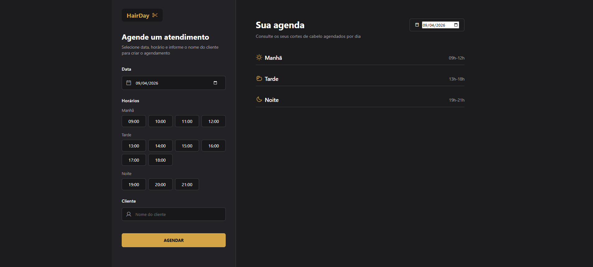

### 🌟 Introdução

* **Nome do Projeto:** Hair Day ✂️
* **Evento ou Contexto:** Desenvolvido como projeto final do módulo de **JavaScript antes do Framework** na formação da **Rocketseat**.
* **Objetivo Principal:** Criar um sistema de agendamento para salões de beleza, focado na gestão de horários disponíveis e persistência de dados em um servidor local.
* **Detalhes Relevantes:** O projeto marca a transição para um desenvolvimento mais profissional, utilizando ferramentas de build e consumo de API para gerenciar o fluxo de agendamentos de um dia específico.

---

### 🚀 Principais Funcionalidades

O projeto simula o fluxo completo de uma agenda de salão:

1.  **Agendamento por Horário:** O usuário pode inserir o nome do cliente e selecionar um dos horários disponíveis (ex: 9:00, 10:00, 11:00, etc.).
2.  **Verificação de Disponibilidade:** O sistema identifica quais horários já estão ocupados e os desabilita na interface, impedindo agendamentos duplicados.
3.  **Listagem Dinâmica por Período:** Os agendamentos são organizados visualmente entre "Manhã", "Tarde" e "Noite".
4.  **Cancelamento de Horário:** Permite remover um agendamento diretamente da lista, liberando o horário instantaneamente para um novo uso.
5.  **Persistência com JSON Server:** Todos os dados são salvos e recuperados de um servidor simulado, garantindo que as informações não sumam ao atualizar a página.

---

### 🛠️ Tecnologias Utilizadas

* **HTML5 & CSS3:** Estrutura e estilização com foco em uma interface limpa, moderna e responsiva. 🎨
* **JavaScript (ES6+):** Utilizado para toda a lógica de agendamento, validações e comunicação assíncrona. 🧠
* **Webpack & Babel:** Configuração de ambiente para transpilação e empacotamento do código para produção. 📦
* **JSON Server:** Utilizado para simular um banco de dados e uma API REST para persistir os agendamentos. 🌐
* **Day.js:** Biblioteca para manipulação e comparação de datas e horários de forma precisa. 📅

---

### 📸 Aparência do Projeto

### 📚 Lições Aprendidas

O desenvolvimento deste projeto aprimorou habilidades técnicas avançadas:
* **Consumo de APIs REST:** Prática com métodos `GET`, `POST` e `DELETE` para gerenciar recursos no servidor.
* **Gerenciamento de Fluxo:** Lógica complexa para garantir que a interface reflita exatamente o que está salvo no banco de dados.
* **Configuração de Bundlers:** Entendimento profundo de como o Webpack organiza os módulos do projeto.
* **Manipulação de Datas:** Tratamento de fusos horários e períodos do dia para organização da agenda.

---

### 🏁 Conclusão

O **Hair Day** é um projeto robusto que demonstra a maturidade no uso do JavaScript puro antes da adoção de frameworks como o React. A integração entre uma interface amigável e um back-end simulado permitiu a criação de uma ferramenta que resolve um problema real de logística, resultando em uma aplicação sólida e escalável para fins de aprendizado. ✨
